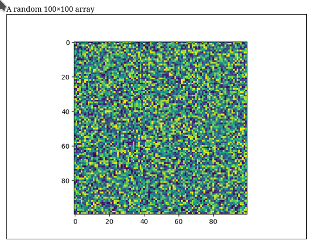

# Domrep

Generate HTML reports from Python.  Build on top of [dominate](https://github.com/Knio/dominate).

Features:

- `plot(...)` - automatic handling of Matplotlib Figures, Animations or numpy arrays
- `caption(...)` - caption your report figures
- `itemgrid(...)` - flexible grid layout for arrays of figures
- `slider(...)` - interactive slider for array of figures

## Quickstart

``` sh
pip install domrep
```

## Examples

A basic document with plot and figure caption

``` python
import domrep
from dominate import tags, document

import matplotlib.pyplot as plt
import numpy as np

with document('My Report') as doc:
    domrep.caption(
        "A random 100×100 array",
        domrep.plot(
            plt.imshow(np.random.random((100, 100)))
        )
    )
open('output.html', 'w').write(doc.render())
```


    