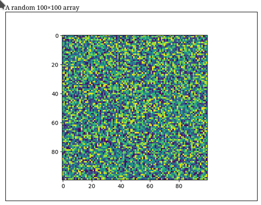
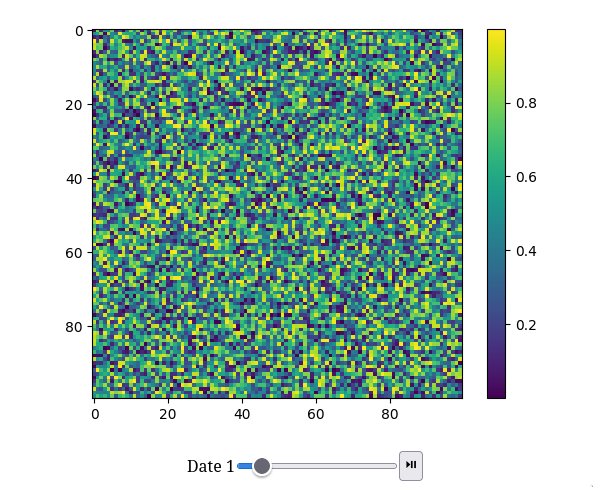

# Domrep

Generate HTML reports from Python.  Build on top of [dominate](https://github.com/Knio/dominate).

Features:

- `plot(...)` - automatic handling of Matplotlib Figures, Animations or numpy arrays
- `caption(...)` - caption your report figures
- `itemgrid(...)` - flexible grid layout for arrays of figures
- `slider(...)` - interactive slider for array of figures

## Quickstart

``` sh
pip install domrep
```

## Examples

A basic document with plot and figure caption

``` python
from domrep import *
import matplotlib.pyplot as plt
from numpy.random import random

with document('My Report') as doc:
    # any item can be captioned
    with caption("A random 100×100 array"):
        # `plot` accepts any matplotlib figure/animation or image
        plot(plt.imshow(random((100, 100))))

        # or alternatively, if you to tweak the plots
        # with plot():
        #     plt.imshow(random((100, 100)))
        #     plt.colorbar()

doc.save('output.html')
```


    
``` python
# use sliders to view many images/plots
images = random((10, 100, 100))
dates = range(10)
with slider():
    for date, image in zip(dates, images):
        # plot() also works as a context manager
        with plot(label=f'Date {date}'):
            plt.imshow(image)
            plt.colorbar()
```

